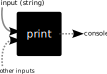

# Functions
Functions are, in my opinion, the most important thing to understand when it comes to programming. Thinking about things in terms of functions can help immensely as you go along. The good news is that they are quite easy to understand.

## The `print` function
I could jump in and try to explain this function, but I think it is actually better if we take a slight detour and make our own function first, and then come back to this

## Your first function
Copy and paste this into your editor and hit run:
```python
def add(a, b):
    return a + b

num1 = 12
num2 = 5
output = add(num1, num2)
print(output)
```
Output:
```
17
```
Whew! A lot going on here. Let's break it down line by line again:
1. `def add(a, b)`
    1. `def`: this is what we call a *keyword*, or a *reserved word*. It tells Python that we are about to define a function
    2. `add`: this is the name of our function
    3. `a, b`: this is a comma separated list of *parameters* to our function which serve as variables we can access in the body of the function
2. `return a + b`: this is probably the weirdest part. `return` is another keyword, which serves to tell Python that we want to output the expression after it back to whoever called the function. We cannot add any more lines after this, which makes sense because we have already output something back to the user
3. `output = add(num1, num2)`: here we *called* our function with the variables we made earlier, and assigned its output to the variable `output`

This is quite a bit, so make sure to take it all in. Essentially, to make a function, we need to:
1. Give it a name
2. Give it some parameters, any number (even none at all!)
3. Give it a body where we do some stuff
4. Optionally return a value

These are all valid functions:
```python
def subtract(a, b):
    return b - a

def sayHello():
    print("Hello")

def areaOfTriangle(base, height):
    return (1/2) * base * height
```

Note that the code in the function does not execute until we actually call it, which we do by adding a set of parentheses enclosing our *arguments*. This is an important distinction! When the variables are in the first set of parentheses after the function name (the `def` part), commonly referred to the *definition* of the function (hence the keyword "def") they are called parameters, but when you use variables or values to call a function, they are called *arguments*.

## How to visualize functions
I recommend using a "black box" method. That is, think of the function as a black box which takes some input and magically spits out something. So our add function might look like this:


It is not important for anyone else to know what is happening inside the function, all they know is they put two numbers in and this function adds them. This is an important reoccurring concept. For this case we know exactly whats happening because we wrote it, but if you are reading someone else's code you can take their (hopefully descriptive) function name at face value. Now you might be thinking, what does the `print` function black box look like? Maybe something like this:


This is wrong! I will explain why.

## Back to our friend the `print` function
So why was the above visualization wrong? Well remember how I said functions have outputs? Let's see what the `output` of print is:
```python
def add(a, b):
    return a + b

out = add(2, 3)
print(out)
out = print("Hello World!")
print(out)
```
Output:
```
5
Hello World!
None
```
Huh??? What is `None`? Why was that the output of `print`?

Let's start with the `None` thing: Python has the concept of a value that means "nothing", or that "there is no value". This may sound weird at first until we consider the fact that this is super useful to have and exists everywhere:
- Numbers have a 0, because we want to know when we have 0 of something, just like when we have 2 or 200 of something
- The languages we speak all have words for "nothing", because again, we need to know when we have...nothing! It would be weird and hard to understand if there was an empty pause every time we meant to say nothing

Now, why was the output `None`? Well that is because `print` actually does not output (`return`) anything. We can make a function ourselves that returns nothing to prove this:
```python
def nothing():
    return None

output = nothing()
print(output)
```
Output:
```
None
```
In fact, in Python, if we do not have a return statement, or simply leave the expression after `return` blank, it automatically makes it return `None`. Note that this is a language specific thing, and not every language operates like this. Here is an example:
```python
def nothing():
    return

out = nothing()
print(out)
```
Output:
```
None
```

## So if `print` does not `return` anything, why is there output in the console?
Additionally, why do our functions that actually return things not show up in the console? Why do we need to use `print` afterwards?

So here is where the black box analogy can struggle: the `print` function actually affects things *outside* of the function itself. Basically, unlike our `add` function up there which was only touching the `a` and `b` variables it defined, the `print` function affected things that were not in the input, and used those *side effects* to make things appear in our console. If that sounds confusing, don't worry, it is a bit tricky. But basically, we can instead visualize our `print` function with the concept of hidden inputs and outputs:



For now, don't worry about how it actually shows up to the console, or where this hidden output is. You'll learn about that in later sections. Many times people just forget about this way of visualizing functions because of this inconvenience. However, I promise it is worth it to use this slightly weird concept of hidden inputs and outputs instead to make the visualization work.

For now, just know that:
1. `print` does not return anything
2. Even though it has one input, there are other things it is affecting
3. You can visualize those other things as hidden inputs/outputs, even though Python does not actually have the concept of hidden inputs and outputs

## Wow! Functions sound like a real pain! I think I'll avoid them...
NO! Functions are way to useful to let some new keywords and hidden inputs/outputs to scare you away. They let you define things in one place and use them over and over. The `add` example seems pointless, but that is because Python gives you a builtin `add` function, the `+`, so it is kind of redundant. But if we were doing something even slightly complicated like the area of a triangle function I wrote earlier, we can reuse that logic over and over to save ourselves time and make our code cleaner and easier to *maintain*:
```python
def areaOfTriangle(base, height):
    return (1/2) * base * height

vol1 = areaOfTriangle(4, 10)
print(vol1)
print(areaOfTriangle(3, 4))
```
Output:
```
20.0
6.0
```
This is still pretty basic, but it is easier to read, and most importantly if we ever need to change the logic for `areaOfTriangle`, its already all in one spot which makes things easier. 

There are many, *many* more advantages functions have, and as we progress they will become apparent