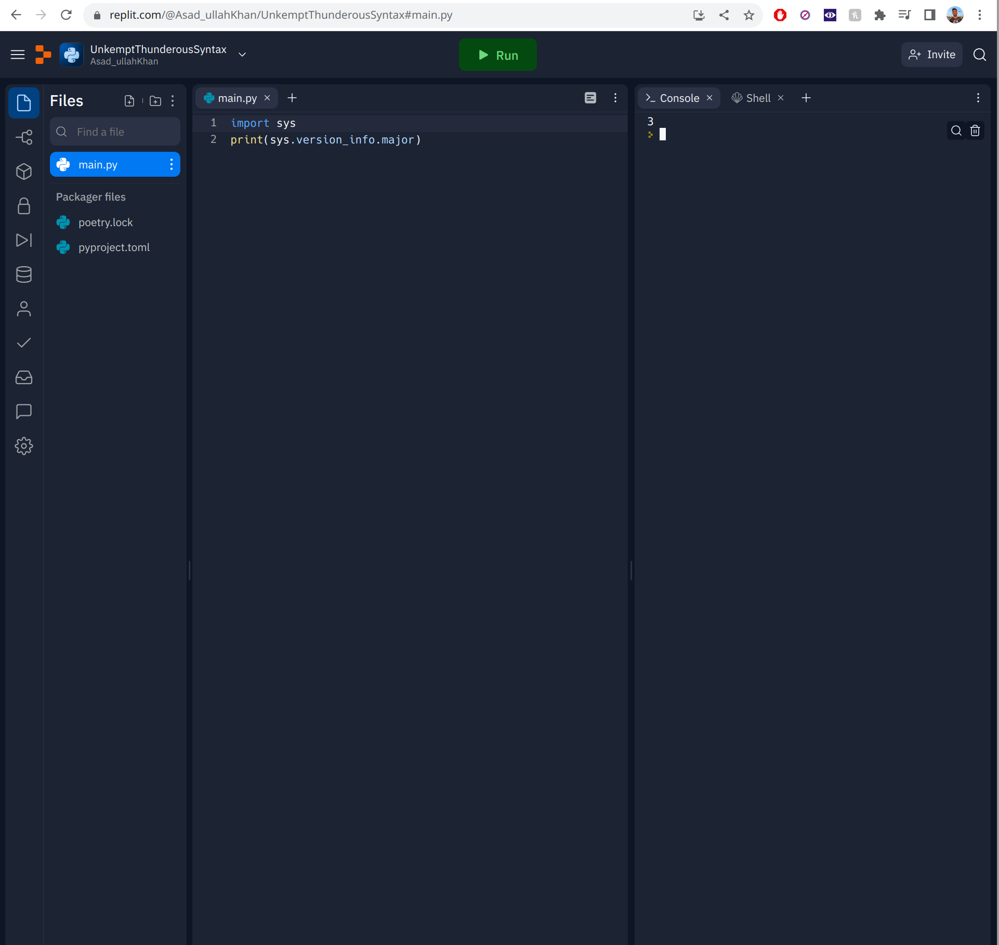

# Hello World
Ah, the pinnacle of programming. Every programmer starts with a "hello world" program, as will you. Let's get started.

## Setup
Here I will be making a shift: many tutorials start with an agonizing development environment setup that can suck the joy out of many a beginner (or even experienced) programmer. Instead, we will be using the glory of an **Online IDE**. Fear not, it will have all the features you need, will be fully setup, and can be accessed from anywhere you have a browser.

You are free to use any online IDE, but I strongly recommend [Replit](http://repl.it), as it is free and easy to use. Sign up, create a new Repl, make sure to select Python. It should be Python version 3. You will see a code editor on the left. Here is what mine looks like (it may look different):


You see I have some code in the left side:
```python
import sys
print(sys.version_info.major)
```
Paste this in to whatever IDE or editor you are using, Replit or otherwise, and ensure that after you run (the green "Run" button in the case of Replit) the console on the right outputs a "3". This is to make sure we are on Python 3, and not 2. If you get an error, you are on the wrong version.

Ignore the other files that are there, and do not open them or edit them. They are not relevant.

**IMPORTANT**: As a note to yourself for the distant future: do not *ever* write proprietary code in an online IDE, or any code that you want to own yourself. It is not safe from a legal or security standpoint, please do not do it. I will show you how to properly set up your environment locally later on, and it is not even that hard. It's just that right now I want to get you started as quickly as possible, and this is the best way to do that. The code you will write as a beginner will not be so important tha you need to copyright it, but in the future it may be.

Now that you are on the right version, delete that code and pretend that you never ran it, because now we will write our first legitimate piece of software.

## The actual code
In the editor, type:
```python
print("Hello World!")
```
and hit run. You should see the words printed on the right like so:
```
Hello World!
```
This output area is known as the console. Later on we will discuss what is going on in more depth, as even a simple hello world program has much to be explained. Suffice it to say, the console is where you will see your program output, as it is (usually) very easy to output text to it in most languages, Python included. In fact, in Python it is only one line as you can see here.